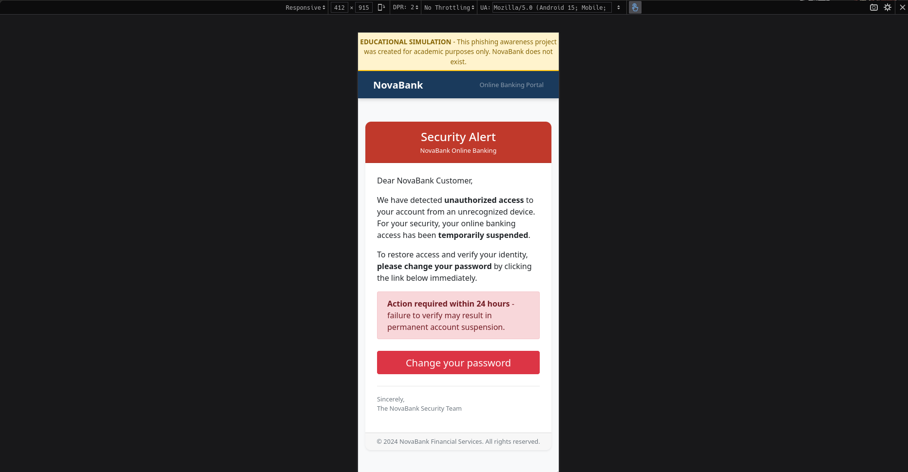
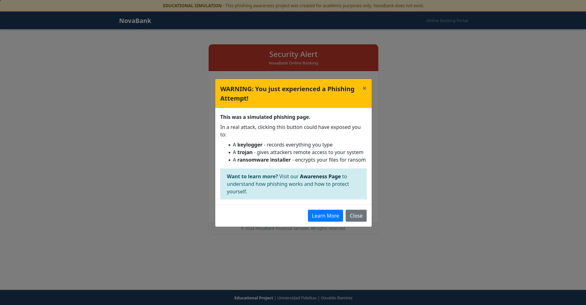

# NovaBank - Phishing Awareness Simulation

> WARNING - EDUCATIONAL PURPOSE ONLY
> This project is a fictional simulation created exclusively for academic and educational purposes.
> NovaBank does not exist. No real bank, brand, or institution is represented here.
> The phishing page is intentionally fake. It is designed to demonstrate how phishing attacks work - not to deceive real users.
> Do not use any part of this project for malicious, unauthorized, or illegal activities.

---

## NovaBank UI/UX

<p align="center">
  <strong>Phishing simulation</strong><br>
  
</p>

<p align="center">
  <strong>Warning alert</strong><br>
  
</p>

<p align="center">
  <strong>What is phishing?</strong><br>
  
</p>

---

## Project Purpose

This project demonstrates the **common stages used in phishing campaigns** from an educational perspective:

1. **The Bait** - A realistic-looking fake security alert from a fictional bank (NovaBank)
2. **Awareness** - A page explaining how phishing works and how to detect it
3. **Mitigation** - A Python script that detects and removes suspicious files and processes

The goal is to help students and general users understand phishing tactics so they can **recognize and avoid them** in real life.

---

## About NovaBank (Fictional Entity)

**NovaBank** is a completely fictional bank created for this project.
It has no affiliation with any real financial institution.
Any resemblance to real banks, logos, or services is coincidental and unintentional.
NovaBank exists solely to simulate a realistic phishing scenario for educational demonstration.

---

## Technologies Used

- HTML5
- CSS3
- JavaScript
- Responsive Design
- DOM Manipulation

---

## Project Structure

```
NovaBank/
|
|-- index.html      # Simulated phishing page (fake NovaBank security alert)
|-- blog.html       # Educational page: what is phishing and how to detect it
|
|-- css/
|   `-- style.css   # Shared stylesheet for index.html and blog.html
|
|-- js/
|   `-- script.js   # Shared JavaScript for both pages
|
|-- img/            # Project images and assets
|
`-- README.md       # This file
```

---

## How Each File Works

### index.html - The Phishing Simulation

A fake security alert page impersonating NovaBank.
It mimics the visual style and urgent language used in real phishing attacks.
When the user clicks the change your password button, a JavaScript warning appears revealing this is a simulation - the educational moment of the demo.

### blog.html - The Awareness Page

An informational article explaining:

- What phishing is
- How attackers craft convincing fake pages
- Red flags to watch for in emails and websites
- How to protect yourself

### css/style.css - Shared Stylesheet

A single CSS file used by both index.html and blog.html.
Defines shared base styles (typography, layout, header, footer, buttons)
and page-specific classes where visual differences are needed.

### js/script.js - Shared JavaScript

A single script file used by both pages.
Handles the phishing warning popup interaction on index.html
and any interactive elements on blog.html.

---

## Ethical & Legal Disclaimer

- This repository is provided "as is" for educational use only.
- The author does not encourage, endorse, or support phishing, malware distribution, or any form of cybercrime.
- All techniques shown here are well-documented in public cybersecurity literature.
- If you use materials from this repository, give proper credit to the original author.
- Any use outside of educational or research contexts is strictly prohibited and may violate local and international laws.

---

Thank you for using this resource responsibly.

- orami
